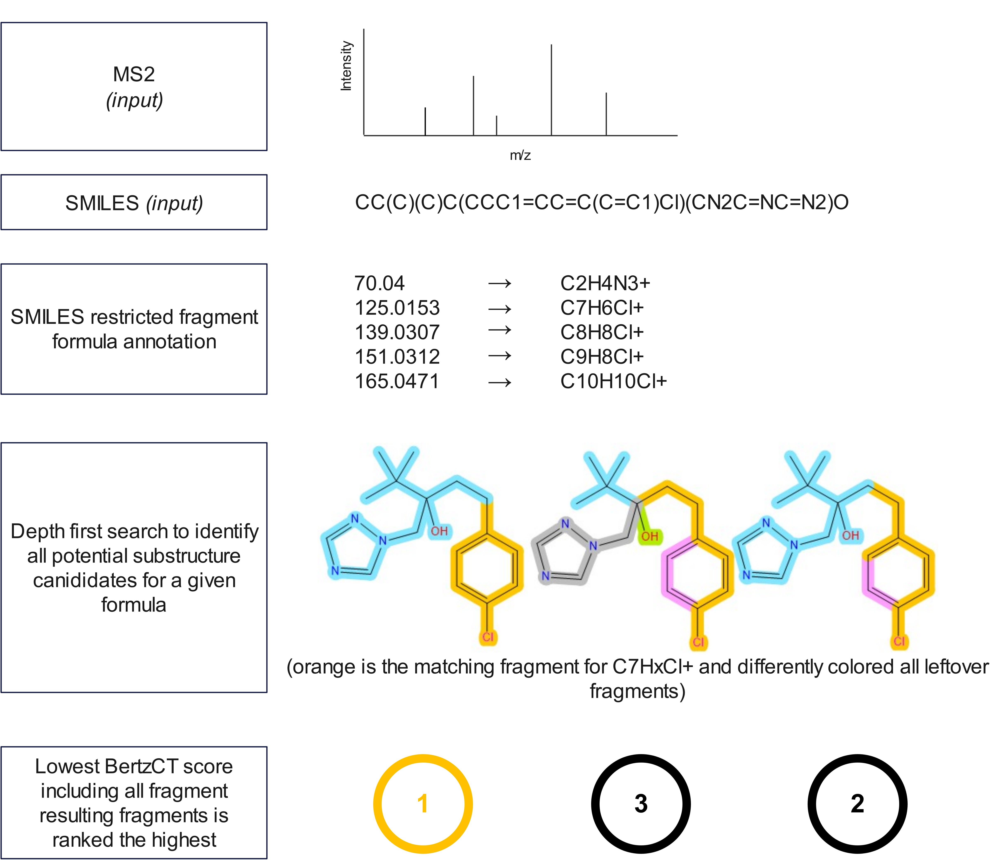

**MS2X stands for MS2 eXplained and gives structural fragment-annotations for a given smiles-spectrum pair.**


## ✨ Why use MS2X?
⚡ The current setup allows large scale analysis of MS2 dataset (speed heavily depends on molecular size and number of fragments)<br>
🔍 Understandable - no fancy ML algorithm, just brute force graph search combined with BertzCT candidate ranking. This allows to understand the limitations more easily. <br>
⚠️ Limitations: The recommended structures are only approximations and do not rely on chemical knowledge, but simply on the idea that the molecular complexity of the produced fragments is lower for correct fragmentation pathway! <br>

## 🛠 Installation
```
conda create -n ms2x python=3.10
conda activate ms2x

git clone https://github.com/j-a-dietrich/MS2X.git
cd MS2X
pip install -e .
```

## 🚀 Quickstart
**Spectra based**
```
from matchms.importing import load_from_mgf
from ms2x import MS2X

ms2x = MS2X()
for spec in load_from_mgf(test_spectra.mgf):
    substructures, subformulas = ms2x.approximate_substructures(spec, charge=1) 
```

**Fragment based**
```
from ms2x import MS2X

ms2x = MS2X()
substructures, subformulas = ms2x.approximate_substructures_by_fragments([151.0309], "CC(C)(C)C(CCC1=CC=C(C=C1)Cl)(CN2C=NC=N2)O", charge=1) 
```

*see more in demo.ipynb*

## 🔬 Under the Hood


## 🗂️ Future tasks
- extend templates for small formulas (small m/z are often related to the same formula and substructure but can be difficult to extract for MS2X because it ignores H count the seperation through BertzCT is less clear); current template C5H5 is fragmentation of benzene if benzene in molecule
- time-cut off for large fragment-molecule combination should be manually changable
- elements used for formula search should be a user input

## 📬 Get in Touch

💡 Questions, ideas, or contributions? Open an issue.

## 📚 Citation
coming soon (hopefully)